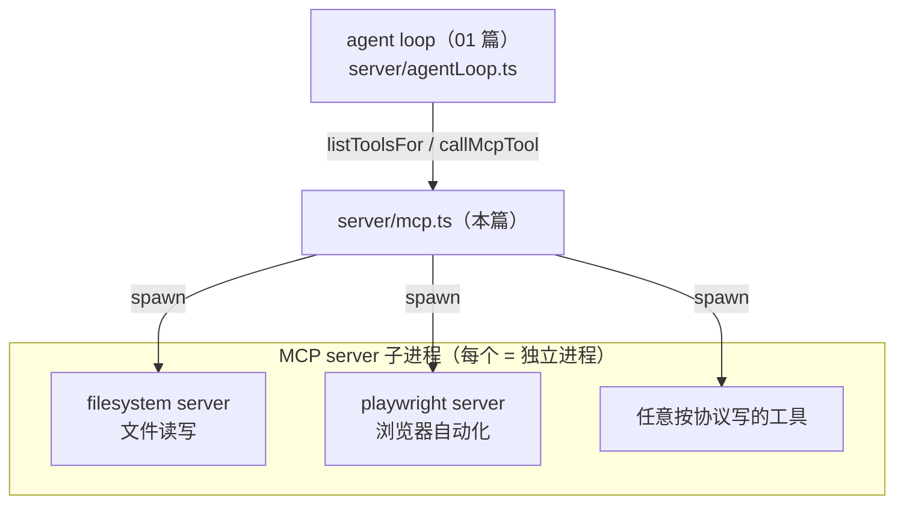

# 代码走读 02：MCP 客户端 —— 怎么把外部工具变成 agent 的手

> 上一篇（01）讲了 agent 循环是怎么"转"的；本篇看它最大的"手"从哪来。
> 文件：`server/mcp.ts`（约 252 行）——MCP 客户端管理：拉起 MCP server 子进程、健康检查、自动重连、调用工具。
> 建议先读完 01，再读这篇。

## 0. 术语速查（先消化再读，别硬猜）

| 名词 | 大白话 |
|---|---|
| **MCP（Model Context Protocol）** | 让 AI 工具"即插即用"的开放协议（AI 界的 USB-C）。协议约定了两边怎么说话：一方是 server，一方是 client |
| **MCP server（服务端）** | 工具的提供方，是一个**独立进程**（任意语言写的程序），通过标准输入输出（stdio）跟外界对话。例：filesystem server = 文件工具，playwright server = 浏览器工具 |
| **MCP client（客户端）** | 连接方（本项目就是它）。负责拉起 MCP server 进程、跟它握手、拿到工具清单、调用工具 |
| **stdio（标准输入/输出）** | 进程跟外部交换数据的默认通道。MCP server 的"程序入口"就是一行行 json 从 stdin 进来、从 stdout 出去——**不需要开端口**，本地工具就用这个 |
| **子进程（child process）** | 由一个程序启动的另一个程序。我们的 Node 进程用 `spawn` 去启动 MCP server 进程，server 进程就是我们的子进程 |
| **spawn（派生）** | Node 里启动一个新进程的 API（相当于命令行开了个新程序） |
| **工具清单（listTools）** | MCP server 自报家门：我有这些工具，每个叫什么、干嘛的、参数长什么样（JSON Schema） |
| **ping（探活）** | MCP 协议里没有任何参数的"在吗？"消息。连接是长活，对方可能悄悄死了，需要用 ping 探测是否还活着 |
| **健康检查（health check）** | 定期/按需问"你还好吗"，坏了就标记断开并安排重连 |
| **指数退避（exponential backoff）** | 重试策略：每次失败后，等待时间翻倍（5s → 10s → 20s → …），封顶。防止"服务器还没好就疯狂重试"造成重试风暴 |
| **Promise.race** | 让多个异步"赛跑"，谁先出结果算谁的。常用来做超时：`工具调用 vs 定时器`，定时器先触发就超时 |
| **超时（timeout）** | 一条命令/调用最多等多久，超了就强制终止（防工具无限挂起烧死 agent） |
| **配置热加载** | 改配置后**不用重启程序**就生效。本项目 MCP 配置存 json 文件 + 管理页 CRUD，存/删/改后重新拉取即生效 |
| **connections（连接池）** | 一个 Map：server id → 活跃连接。每个 MCP server 一个连接实例，复用，不重复起进程 |

---

## 1. 它在架构里的位置



`mcp.ts` 是**桥**：上面接 agent loop（给它工具），下面接一堆外部工具进程。核心工作三句话：
**拉起进程 → 拿到工具清单 → 按需调用**，外加"进程会不会死"的看护（健康检查 + 重连）。

---

## 2. 核心数据结构：McpConnection（L25-32）

```ts
interface McpConnection {
  config: McpServerConfig   // 这份配置（command/args/env 等）
  client: Client            // MCP SDK 的 client（跟 server 对话的"嘴"）
  transport: StdioClientTransport // 通信管道（走 stdio）
  tools: McpTool[]          // 从 server 拉到的工具清单
  lastError?: string        // 最近一次错误（展示给管理页）
  retryCount: number        // 已重连几次（指数退避用）
}
```

全局只有一个 `connections` Map（L34）：`server id → McpConnection`。
**一个 server 一个连接，复用不重复起进程**——这是连接池思想。

---

## 3. 配置加载：loadMcpConfigs（L37-54）

把 `mcp-servers/` 目录下所有 `.json` 读成配置数组：

```ts
return readdirSync(dir)
  .filter((f) => f.endsWith('.json'))         // 只认 .json
  .map((f) => { ... parse ... })
  .filter((c) => c.command)                    // 必须有 command（拿什么启动）
```

配置长这样（`mcp-servers/filesystem.json`）：

```json
{ "id": "filesystem", "name": "文件系统",
  "command": "node",
  "args": ["node_modules/.../index.js", "{{workspace}}"],
  "timeoutMs": 30000 }
```

**"配置即授权"是这个项目的安全哲学**：你往这个目录写一个 json，agent 就拥有这套工具；删掉它，agent 就没有。不给配置 = 不给能力。

小细节：args 里的 `{{workspace}}` 是工作区占位符，在建立连接时被替换成工作区真实路径（`resolveMcpArgs`，见 workspace 篇）——这样 filesystem server 永远挂载在当前工作区，用户改工作区后自动跟随。

---

## 4. 动态管理：saveMcpConfig / deleteMcpConfig（L61-84）

```ts
saveMcpConfig(config)   // 写 mcp-servers/{id}.json（异步开头，id/command 校验）
deleteMcpConfig(id)     // 删文件
```

这两个配合 `server/routes/index.ts` 里 MCP 管理页的 CRUD 接口：**在页面上增删改一个工具，就是写/删/改一个 json 文件**，不需要重启后端——这就是"配置热加载"。管理页随后调 `reconnectServer`/删除连接让改动立刻生效。

> 安全点：`id` 只允许 `[\w-]+`（字母数字下划线连字符）——防止用户把不安全的文件名写进路径。

---

## 5. 建立连接：establish（L121-147）——全篇核心

三个动作，缺一不可：

```ts
const client = new Client({ name: 'nova-agent', version: '0.1.0' }, ...);  // ① 建 client（协议"嘴"）
const transport = new StdioClientTransport({
  command: config.command,
  args: resolveMcpArgs(config.args ?? []),   // ② 通信管道：command/args 启动子进程
  env: envFor(config),
  stderr: 'pipe',
})
await client.connect(transport)               // ③ 握手（协议初始化）
const listed = await client.listTools()       // ④ 拉工具清单
```

①②理解：MCP server 是一个**独立程序**（如 `node xxx/index.js`），我们通过 `spawn` 把它跑成子进程，并把"对话通道"连到它的**标准输入/输出**上——这就是 `StdioClientTransport` 干的事。💡 为什么用子进程而不是把工具代码塞进我们进程里？

- **语言无关**：server 可以是 Python/Go/任何语言，只要按协议用 stdout 说话
- **隔离**：server 崩溃/干坏事不影响我们主进程
- **即插即用**：换个 server = 改一行配置，代码零改动

④拿到 `tools` 后存进连接（L137-143），agent loop 用 `listToolsFor` 就能把它们包装成模型可调的工具。

---

## 6. 复用与换新：connectServer（L149-155）

```
if (已有连接 && isConnected(existing)) return 已有连接   // 复用，别重复起进程
else establish(config)                                    // 新连
```

`isConnected` 判断才复用——防止"连接还挂着但进程已死"还傻傻复用。

---

## 7. 健康检查：checkHealth / isConnected（L158-186）

**为什么要关心进程死活**：连接是长活，但 MCP server 可能因为崩溃/被杀/网络问题悄悄死了。agent 不知道，下次调用会拿到一堆错误。所以做一个"看护巡检"：

```ts
async function isConnected(conn) {
  await Promise.race([
    conn.client.ping(),                       // 问一句"在吗？"
    new Promise((_, rej) => setTimeout(() => rej(new Error('ping timeout')), 3000))
  ])
  ...
}
```

`checkHealth`（L158）遍历所有连接挨个 ping：活的→正常；死的→标记断开 + 安排重连（`scheduleReconnect`）。管理页的"连接状态"就是它喂的。

`Promise.race([ping, 3秒定时器])` ——这就是超时惯用法：ping 3 秒没答复就当它死了，不让巡检被一只死连接卡住。

---

## 8. 自动重连：scheduleReconnect（L191-215）——指数退避

```ts
const delay = Math.min(RECONNECT_BASE_DELAY_MS * 2 ** conn.retryCount, RECONNECT_MAX_DELAY_MS)
//          = 5s * 2^重试次数，封顶 120s
conn.retryCount += 1
setTimeout(async () => { ...重新 establish... }, delay)
```

**为什么翻倍等待**：如果 server 挂了要重启，疯狂每秒重试只会刷爆日志、撞上它还没就绪——"重试风暴"。指数退避：5s→10s→20s→40s→80s→120s，既给足恢复时间，又不会无限烧。重试成功就重置 `retryCount`；失败继续退避；**超过 20 次暂停**，等手动触发或下次调用再试——保底，别永动机式重试。

（这个"退避参数"跟 agent 循环里 "失败重试最多 1 次" 的分级策略是同一个精神：**有限度的坚持**。）

---

## 9. 调用工具：callMcpTool（L217-233）

agent loop 调工具的最终落点：

```ts
const result = await Promise.race([
  conn.client.callTool({ name, arguments: args }),
  new Promise((_, rej) => setTimeout(() => rej(new Error('timed out')), timeoutMs))
]) // 超时兜底：工具卡死就强制终止
// MCP 结果是一个 text 数组 → 拼成字符串返回给模型
return content.map(c => c.text).filter(Boolean).join('\n')
```

两个要点：
- **超时**：默认 120 秒（工具声明可覆盖），用 `Promise.race` 实现——工具永远不返回也不至于把 agent 挂死
- **结果变字符串**：MCP 返回的结构化内容被拼成一段文本，作为"工具输出"送回给模型（模型只认文本）

---

## 10. 对外的接口（L236-252）

- `listToolsFor(mcpServerIds)` → agent 勾选了哪些 server，就把那些工具合并出来（agentLoop 经 toolRegistry 的统一装配使用）
- `getHealth()` → 供 `/api/health` 汇总
- 加上 `callMcpTool` 和 `disconnectServer`/`reconnectServer`（管理页删除/重连用）

---

## 11. 名词复盘 + 动手建议

**一句话记牢**：MCP = "拉起工具进程（spawn）+ 用它清单（listTools）+ 按需调用（callTool）+ 看护别死（ping/重连）"。

动手做（强烈推荐第 4 个）：

1. **看配置**：打开 `mcp-servers/*.json`，对照 `loadMcpConfigs` 读一遍。
2. **玩热加载**：设置页 → MCP 服务器，加一个 server 保存 → 看工具管理页立刻多一波工具（不用重启）。
3. **故意搞坏它**：把 `mcp-servers/playwright.json` 的 `command` 改成 `"nonexistent-cmd"`，保存 → 管理页显示连接失败 → 看后端日志里的指数退避重连尝试（`[mcp] server ... reconnected`）。
4. **写一个 10 行的 MCP server 亲手体会协议**（这是理解 MCP 最快的方式）：

```js
// my-tool-server.js —— 一个极简 MCP server（用官方 SDK）
import { McpServer } from '@modelcontextprotocol/sdk/server/mcp.js'
import { StdioServerTransport } from '@modelcontextprotocol/sdk/server/stdio.js'
const server = new McpServer({ name: 'demo', version: '1.0' })
server.tool('add', { a: { type: 'number' }, b: { type: 'number' } }, ({ a, b }) => ({
  content: [{ type: 'text', text: String(a + b) }],
}))
await server.connect(new StdioServerTransport())  // 从标准输入读请求、往标准输出回结果
```

然后配置里加 `{ "id": "demo", "command": "node", "args": ["./my-tool-server.js"] }`——保存，你的 agent 立刻多了一个 `add` 工具。**看懂这段，MCP 对你就没有秘密了。**

---

## ✅ 读完自查（你能做到吗）

- [ ] 能用一句话说清"MCP server=独立进程（工具提供方）/ client=我们（连接方）"的模型
- [ ] 能背出建立连接的四步（建 client → 建 stdio transport → connect 握手 → listTools），并解释每一步在干嘛
- [ ] 能解释为什么重连要用"指数退避"而不是每秒重试（防重试风暴）
- [ ] 能说出"配置即授权"这个安全哲学：给一个 json = 给一种能力，删掉 = 收回
- [ ] 动手：自己写一个 10 行的极简 MCP server（`add` 工具）并让 agent 用起来

> 卡住了？回头读对应小节；做完这 5 条再进 [练习册 02](../exercises/02-mcp.md)。


## 附：关联地图

```
mcp.ts（本篇：MCP 客户端桥）
 ├── agentLoop.ts → assembleTools（统一装配，见 01 篇）
 ├── toolRegistry.ts → listToolsFor 拉清单 + callMcpTool 包装成模型工具（MCP 工具注册管道）
 ├── types.ts     → McpServerConfig / McpTool
 ├── workspace.ts → resolveMcpArgs（{{workspace}} 占位符 → 工作区路径）
 ├── routes/...   → 管理页 CRUD（save/delete/reconnect）
 └── 依赖包       → @modelcontextprotocol/sdk（Client / StdioClientTransport）
```

下一篇（03）建议：`server/terminal.ts` —— run_command：agent 的一双手 + 进程生命周期（超时/中断杀树，Windows 上踩过的坑讲透）。
