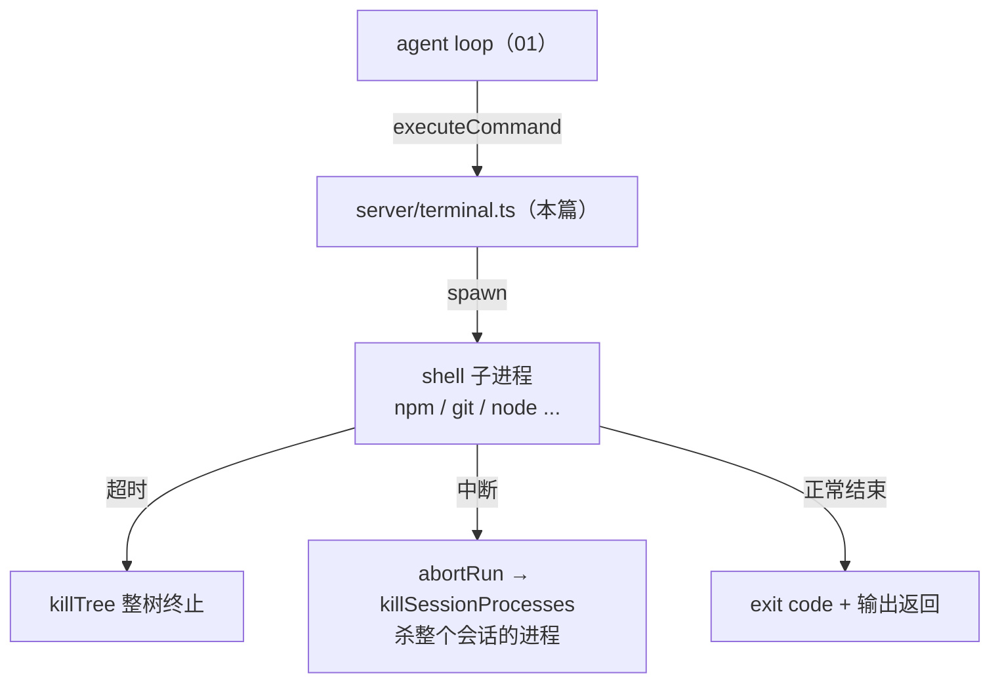

# 代码走读 03：run_command —— agent 的双手 + 进程生命周期

> 有了读文件/写文件（MCP filesystem），agent 还是"半残疾"——它不会跑命令，没法构建、测测试、启动项目。
> 这篇讲 `server/terminal.ts`（约 160 行）补上这双手：执行 shell 命令、捕获输出、超时终止、以及最重要的——**把进程管起来，不留幽灵**。
> 建议先读 01、02。

## 0. 术语速查

| 名词 | 大白话 |
|---|---|
| **shell / 命令** | 操作系统给人类调度的"命令行"。`npm run build`、`git status` 都是命令；shell（Windows 的 cmd、Linux/Mac 的 sh/bash）负责解释执行 |
| **spawn（派生）** | Node 里启动一个新进程的 API——等于在命令行敲了条命令，开出一个子进程 |
| **子进程（child process）** | 我们 Node 程序启动的另一个程序。`spawn` 出来的命令就是我们的子进程 |
| **进程树（process tree）** | 命令会再拉起子命令（如 `npm run dev` 里 npm 又起 node），形成"父→子→孙"的树。**杀进程要连树根一起杀，否则孙辈还活着** |
| **detached（脱离）** | spawn 的一个选项：让子进程成为一个独立的"进程组组长"。这样以后能对**整个组**发信号杀死（unix 用） |
| **SIGTERM / SIGKILL** | 两种终止信号：SIGTERM 温和（让程序自己收拾完再退），SIGKILL 强杀（拦不住）。杀进程树时先温和后强杀 |
| **taskkill** | Windows 系统命令，专门杀进程。`/T` = 连子进程一起杀（整树），`/F` = 强制 |
| **stdout / stderr** | 进程的两个输出通道：标准输出（正常结果）和标准错误（报错信息）。我们要把两个都收进来，否则只看到一半 |
| **Buffer** | Node 里存二进制数据的对象。命令输出是字节流，先攒成 Buffer 数组，最后拼成字符串 |
| **exit code（退出码）** | 进程结束时给的数字：0=成功，非 0=失败（如 1）。看它就知道命令成败 |
| **交互式命令** | 会停下来等你输入（如 `git` 密码提示）的命令。agent 没法"打字"，所以命令必须非交互，否则只能靠超时兜底 |
| **超时（timeout）** | 最多等多久，超过就强制终止。防命令永远跑不完（如启动类命令本质就是"一直跑"） |
| **幽灵进程（zombie/orphan）** | 中断后没被杀干净、还在后台跑的进程。占端口、耗资源，很难发现 |
| **windowsVerbatimArguments** | Node spawn 的一个开关：Windows 下让参数"原样"传给 shell，不帮我们重写引号。**不开会被引号坑**（§5 细讲） |
| **GBK / 乱码** | Windows 中文命令行常按 GBK 编码输出，我们按 UTF-8 读会变乱码。已知限制，不影响判断 |

---

## 1. 它在架构里的位置



一句话：**执行命令 + 三件事兜底（超时/中断/结束）都保证进程被回收**。

---

## 2. 会话进程注册表：sessionProcesses（L26-37）

```ts
const sessionProcesses = new Map<string, Set<ChildProcess>>()  // 会话 id → 该会话正在跑的进程集合

export function registerProcess(sessionId, child) {
  ...set.add(child)
  child.once('exit', () => set?.delete(child))  // 进程自己退出了就自动移出登记
}
```

**为什么要有它**：命令分布在各个 turn 里跑，但"这个会话该清理哪些进程"得有个账本。
中断时 `killSessionProcesses(sessionId)`（L65-71）——把该会话账本上所有进程**连树杀光**。
这就是 01 篇"中断传播"里 `abortRun → killSessionProcesses` 那一环的实际实现：**账本 + 定时核对（监听 exit）**，缺一不可。

---

## 3. 命令边界：cwd 越界防护（L86-95）

命令默认在工作区根跑，`cwd` 参数可指子目录。但必须先校验：

```ts
if (!(sub === wsRoot || sub.startsWith(wsRoot + sep))) {
  return { content: `Error: cwd 必须位于工作区内（${wsRoot}）`, isError: true }
}
```

**为什么**：命令能碰的目录 = agent 的文件边界。如果 `cwd` 能指向工作区外，agent 就能在别处做任何事。这是**边界即安全**：工具实现里必须显式封死，不能靠模型自觉。

---

## 4. 发起命令：跨平台 shell 与目录确保（L97-113）

```ts
const shell = process.platform === 'win32' ? 'cmd.exe' : '/bin/sh'
const shellArgs = process.platform === 'win32' ? ['/c', command] : ['-c', command]
mkdirSync(cwd, { recursive: true })   // 目录要存在（全新 clone 时 workspace 可能还没建）
const child = spawn(shell, shellArgs, { cwd, detached: ..., windowsVerbatimArguments: ... })
registerProcess(sessionId, child)
```

三个细节都是踩过坑换来的：
- **shell 跟平台走**：Windows 用 `cmd /c 命令`，unix 用 `sh -c 命令`——写法不同。
- **先确保目录存在**：shell 在一个不存在目录里启动会直接失败（CI 全新 clone 时 workspace 还没建，就踩过）。
- **两个 Windows 专属坑**，往下看 §5。

---

## 5. 两个 Windows 深坑（教学重点：平台差异都是坑出来的）

### 坑 1：引号被打乱（`windowsVerbatimArguments`）

Windows 下 Node 的 `spawn` 默认会"帮你"给参数加引号/重写引号。当命令里本身带引号（`node -e "console.log(1)"`），重写 + cmd 自身解析叠加，命令就直接坏掉（表现为"输出全丢 / 语法错"）。

修法：`windowsVerbatimArguments: true` —— **告诉 Node：参数原样传，别碰**。

### 坑 2：`detached` 在 Windows 会弄丢输出

`detached: true` 的目的：unix 下让子进程成为进程组组长，之后能用「负 PID」对整个组发信号（§6）。但实测 **Windows 上 `detached` 会让带引号命令的 stdout 直接丢光**。

修法：**Windows 不设 detached**，因为它杀树走 `taskkill /T`（按父子关系递归杀，根本不需要进程组）。

> 结论一句话：**unix 靠"进程组"杀树（要 detached），Windows 靠 taskkill 按父子树杀（不要 detached）**。平台特性决定了实现，别抄一半。

---

## 6. killTree：杀整棵树（L39-62）

```ts
function killTree(child: ChildProcess): Promise<void> {
  ...
  if (win) {
    spawn('taskkill', ['/PID', pid, '/T', '/F'])   // Windows：连子进程树强制杀
  } else {
    process.kill(-pid, 'SIGTERM')                    // unix：对整个进程组温和信号
    setTimeout(() => process.kill(-pid, 'SIGKILL'), 500)  // 500ms 后还没死就强杀
  }
}
```

两个平台的"杀树"思路：**先给机会（SIGTERM/普通），再强杀（SIGKILL /F）** —— 双保险。
为什么非要连树？命令常拉起子命令（npm → node → …），**只杀父进程，孙进程还在跑，照样占端口**。

---

## 7. 执行与三种出口（L120-159）

```ts
const finished = await new Promise(... => {
  child.stdout?.on('data', ...)   // 攒 stdout
  child.stderr?.on('data', ...)   // 攒 stderr
  const timer = setTimeout(() =>   // 定时器：超时杀树，标记 timedOut
    void killTree(child).finally(() => resolveState('timeout')), timeout)
  child.on('error', ...)           // spawn 本身失败（shell 不存在）
  child.on('close', ...)           // 正常退出：记 exitCode，解除等待
})
```

一个 Promise + 三个出口（`exit` / `timeout` / `error`），`Promise` 先 resolve 谁算谁：

| 出口 | 返回给模型什么 |
|---|---|
| **exit**（正常退） | `$ 命令` + 输出 + `--- exit code: N ---`（N=0 成功，非 0 失败信息给模型判断） |
| **timeout**（超时） | 明确写"命令超时已自动终止进程树"，**并把终止前的输出保留**——启动类命令（npm run dev）基本都会超时，模型靠这段输出判断"服务是否起来了" |
| **error**（启动失败） | "命令启动失败"（如 shell 不存在） |

**超时≠失败**，这是个重要的设计视角：对 agent 来说，`npm run dev` 这种"永远不退出"的命令，
超时终止是**正常结局**，关键是把中途输出交出来让它判断。

再看 `finally`（L154-158）：正常退出才跳过清理；**任何异常路径都保证进程被回收**——
"无论怎样都不能留幽灵"是这个文件反复在做的事。

最后 `normalizeCommandOutput`（L74-80）：两路输出合并成一个字符串，超过 2 万字符截断加说明——
**防模型被海量刷屏**（一个 `npm install` 能输出几万行）。

---

## 8. 名词复盘 + 动手建议

**一句话记牢**：run_command = spawn 一条命令 → 秒表（超时）+ 账本（注册表）+ 杀树三保险（中断/超时/结束都回收）。

动手做（第 3 个最能体会"进程树"）：
1. **跑长命令看超时**：让 agent "`node -e 'setInterval(()=>{},1000)'`"（永远在跑），观察它到 120 秒被"超时已终止"。
2. **看打断**：让 agent 跑 `npm run dev`，中途点停止，然后去任务管理器搜进程——确认 node 被清干净（`killSessionProcesses` 在干活）。
3. **比较"杀父"和"杀树"**：手动开 `cmd /c node -e "setInterval(()=>{},1000)"`（有子进程），分别试 `taskkill /PID <父> /F`（只杀父，node 孙进程还活着）和 `taskkill /PID <父> /T /F`（整树灭）。你就懂为什么代码坚持 `/T`。
4. **试引号坑**：临时把 `windowsVerbatimArguments` 改成 `false`，跑 `node -e "console.log(1)"`，看输出怎么丢——切身感受 §5 的坑。

---

## ✅ 读完自查（你能做到吗）

- [ ] 能解释"为什么杀进程要杀整棵树"：只杀父进程，孙进程还活着照样占端口
- [ ] 能说出两个 Windows 专属坑（引号被重写 / detached 丢输出）及各自修法
- [ ] 能说明"超时≠失败"的设计意图：对 `npm run dev` 这类永不退出的命令，超时是正常结局，关键是保留中途输出
- [ ] 能讲清"会话进程注册表"是干嘛的：中断时怎么知道该清哪些进程
- [ ] 动手：跑一个长命令中途打断，去任务管理器确认进程树被清干净

> 卡住了？回头读对应小节；做完这 5 条再进 [练习册 03](../exercises/03-terminal.md)。


## 附：关联地图

```
terminal.ts（本篇：agent 的双手）
 ├── agentLoop.ts → executeCommand（run_command 工具）／killSessionProcesses（中断清理）
 ├── workspace.ts → getWorkspacePath（命令只能在工作区跑）
 ├── server/index.ts → abortRun（用户停止 → 杀进程，见 01 篇）
 └── Node child_process（spawn）/ path / fs
```

下一篇（04）建议：`server/skills.ts` —— 技能系统：SKILL.md 怎么两级加载、按需注入省 token。
