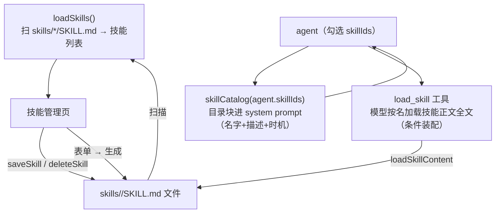

# 代码走读 04：技能系统 —— 目录 + 按需加载，加技能=丢文件夹

> agent 会读文件、跑命令了，但它是"通用白板"——不懂领域套路。
> 技能（Skill）就是给它的"领域操作手册"：`skills/<名字>/SKILL.md` 一个文件夹 = 一本手册，agent 勾上的就照着干。
> 文件：`server/skills.ts`（约 117 行）——扫描、解析、目录、按需加载、增删改。
> 建议顺序：先读 01，再读这篇。

## 0. 术语速查

| 名词 | 大白话 |
|---|---|
| **Skill（技能）** | 一份"操作手册"：教 agent 特定场景怎么干活（比如"怎么用浏览器操作"）。比一句话提示词强在：结构化、可复用、可分享 |
| **SKILL.md** | 技能的文件格式（[Agent Skills 规范](https://www.anthropic.com/engineering/effective-skills-for-claude-code)，Claude Code / Cursor 都用）。每个技能一个 `SKILL.md` 文件 |
| **frontmatter（前置元数据）** | 文件最顶部 `---` 包住的一段键值信息（如 `name:` / `description:` / `when_to_use:`），相当于技能的"身份证" |
| **system prompt（系统提示词）** | 每次对话开始给模型的"总纲"（01 篇讲过）。技能**目录**就拼在这里 |
| **when_to_use（使用时机）** | 告诉模型"这个技能什么时候该用"。写在 frontmatter 里，模型据此判断是否加载 |
| **技能目录（catalog）** | 只含每个技能的"名字+一句话描述+使用时机"的短块，随 system prompt 注入——让模型"知道有什么、什么时候该用"，正文不进来 |
| **按需加载（lazy loading）** | 目录只占几行；模型决定用某个技能时，调用 **`load_skill` 工具**按名字取回该技能**正文全文**。不用的技能不占 token——这是省 token 的真正机制 |
| **条件装配（conditional registration）** | `load_skill` 工具只在 agent **勾选过技能**时才注册（`when: agent.skillIds.length > 0`）。没勾技能 = 没有目录也没有工具，一分钱不花 |
| **目录即安装（drop-in）** | 加一个技能 = 往 `skills/` 丢一个文件夹。不需要写代码、不需要注册，扫到就有 |
| **YAML** | 一种简单的配置文件格式（`键: 值`）。frontmatter 用的是它的极小子集 |
| **路径穿越（path traversal）** | 攻击手段：往路径里塞 `..` 或 `/`，想读写"规定目录之外"的文件。安全代码必须拦这个 |
| **白名单校验（whitelist）** | 只允许"明确允许"的值通过（这里是：只认字母数字中文连字符），比黑名单安全 |

---

## 1. 它在架构里的位置



`agentLoop.ts` 里只有一行用它（01 篇 §7 的 system 组装）：
```ts
const system = `${agent.persona}\n${skillCatalog(agent.skillIds)}${summaryBlock}...`
```
这行把"用户给这个 agent 勾选的技能**目录**"塞进总纲；正文由模型按需用 `load_skill` 工具取。

---

## 2. 文件结构（先看"配置即文件"长什么样）

```
skills/
 ├─ browser-ops/SKILL.md   ← 浏览器操作手册
 └─ file-ops/SKILL.md      ← 文件操作手册
```

一个 `SKILL.md` 长这样（`skills/browser-ops/SKILL.md` 摘录）：

```markdown
---
name: 浏览器操作专家
description: 当用户要求打开网页、搜索、截图、操作浏览器时使用
when_to_use: 打开 URL、网页搜索、页面截图、点击/填写表单、读取页面内容
---
你是浏览器操作专家。使用 Playwright MCP 工具完成网页任务：
1. 打开网页：使用 browser_navigate 工具...
```

`---` 之间是**身份证**（frontmatter），`---` 之后是**正文**（操作手册）。
一个文件夹就是一个技能——**这是"加功能不用写代码"的极致**：往项目里丢个文件夹，模型就有了新本事。

---

## 3. 解析：parseFrontmatter（L15-25）——极简 YAML，够用主义

```ts
function parseFrontmatter(raw: string): { meta: Frontmatter; body: string } {
  const m = raw.match(/^---\n([\s\S]*?)\n---\n?([\s\S]*)$/)   // 抓两个 --- 之间的内容 + 之后的正文
  ...
  for (const line of m[1].split('\n')) {
    const kv = line.match(/^([a-zA-Z_]+):\s*(.*)$/)            // 每行 "key: value"
    meta[kv[1]] = kv[2].replace(/^["']|["']$/g, '')            // 剥掉值的引号
  }
  ...
}
```

**两个设计点**：
1. **手写解析、不引 YAML 库**——frontmatter 只需要"单行 `键: 值`"这一种子集，一个正则搞定。这是项目的一贯哲学：**够用就不加依赖**（对比不少项目为解析 frontmatter 就拉一个库）。
2. 拿不到 `---` 就整篇当正文（`.match` 失败 → `{ meta: {}, body: raw }`）——**容错**：没有元数据的文件也不会崩，还能用。

---

## 4. 扫描：loadSkills（L26-52）

```ts
for (const dir of readdirSync(SKILLS_ROOT, { withFileTypes: true })) {
  if (!dir.isDirectory()) continue                        // 只要目录
  const skillPath = join(SKILLS_ROOT, dir.name, 'SKILL.md')
  if (!existsSync(skillPath)) continue                    // 目录里没有 SKILL.md 就跳过
  ...parse 后压进 skills 数组
}
```

**"目录即安装"就是这么实现的**：扫 `skills/` 下所有目录，里面有 `SKILL.md` 就认作一个技能。
丢文件夹 → 下次扫描就有；删文件夹 → 就没有。**零注册、零数据库**。

---

## 5. 目录 + 按需加载：skillCatalog / loadSkillContent（L53-79）——省 token 的真正机制

**第一级：目录**（`skillCatalog(agent.skillIds)`，L53-67）——只给名字+描述+使用时机：

```ts
export function skillCatalog(skillIds: string[]): string {
  if (!skillIds.length) return ''                    // 没勾技能，一分钱不花
  const entries = skillIds
    .map((id) => getSkill(id))                       // 只取"这个 agent 勾选的"
    .filter(...)
    .map((s) => `- ${s.name}（使用时机：${s.whenToUse || '未指定'}）：${s.description || '（无描述）'}`)
  return ['# 可用技能（按需加载）', ...entries,
    '使用说明：需要用到某技能时，必须先用 load_skill 工具按名字加载它的完整指令，再照做；禁止仅凭上面这行描述执行。']
}
```

**第二级：按需加载**（`loadSkillContent`，L70-79）——`load_skill` 工具的执行体：

```ts
export function loadSkillContent(skillIds, name):
  // 1) 精确匹配：先按 name、再按 id（模型可能记目录里的名字，也可能记文件夹名）
  // 2) 必须在该 agent 勾选的技能里（skillIds.includes）——勾选即授权
  // 3) 返回 { ok:true, content }（全文）或 { ok:false, reason }（未知/未启用）
```

`load_skill` 工具（toolRegistry.ts）**条件装配**：只有勾选过技能才注册
（`when: (agent) => agent.skillIds.length > 0`）。所以三件事天然一致：
- 没勾技能 → 无目录、无 load_skill 工具 → 0 token
- 勾了技能 → 目录几行 + 模型用到时才取正文

**为什么"全量注入"是反模式**：技能可能很长、很多。全塞进 system prompt 会
1) 撑爆 token（每次对话都付全价，哪怕技能根本用不上）
2) 稀释注意力（几十页手册混在总纲里，模型反而抓不住重点）
目录+按需 = 给能力的同时控成本，模型也"被迫"先想清楚用哪个技能。

---

## 6. 增删改：saveSkill / deleteSkill（L96-117）——可视化编辑器的底层

技能管理页的"＋ 新建技能"背后就是这两个函数：

```ts
saveSkill(input): SkillMeta
  // id = 用户给的或 safeId(input.name)（名字转安全目录名）
  // mkdir skills/<id>/ → writeFileSync SKILL.md（renderSkillFile 生成标准格式）
  //   ——所见即所得：表单填的东西 → 一个标准 SKILL.md 文件

deleteSkill(id): boolean
  // 防路径穿越：id 只认 [字母数字中文连字符]，塞 .. / \ 直接拒绝 → rmSync 整个目录
```

`safeId`（L82）：把"浏览器操作专家"变成 `浏览器操作专家`（中文保留）、把"my skill!"变成 `my-skill`——**目录名要安全**。

`renderSkillFile`（L87）+ `parseFrontmatter`（读）正好是**读写对称**：程序生成的文件，下次扫描也能读回来，不会坏。

`deleteSkill` 里那道**白名单校验**（L112）是教学重点：
```ts
if (!/^[\w\u4e00-\u9fa5-]+$/.test(id)) return false
```
因为 `id` 直接拼进文件路径（`join(SKILLS_ROOT, id)`），如果允许 `../` 或 `/`，就能删到工作区外任意目录——**凡是"用户输入拼进路径"，第一件事就是白名单**。这是本文件最该学的一行。

---

## 7. 名词复盘 + 动手建议

**一句话记牢**：Skill = 一个文件夹 + SKILL.md（身份证 + 操作手册）；目录 + `load_skill` 按需加载让"能力上得起、token 控得住"；新增就是丢个文件夹。

动手做：
1. **页面上建一个**：技能管理 → ＋ → 填个"写周报"技能 → 保存 → 去 `skills/` 看生成的 SKILL.md（对得上 `renderSkillFile` 的格式）。
2. **手工丢一个**：新建 `skills/demo/SKILL.md` 写两三行（name/description/when_to_use + 正文）→ 刷新页面——技能列表立刻出现，不用重启。这就是"目录即安装"。
3. **看按需加载**：给 agent 勾上 demo 技能，发一句"用周报技能写周报"——模型应先调用 `load_skill` 取正文再执行；在轨迹视图能看到这次工具调用（这就是"用到才取全文"）。
4. **试路径穿越**：在删除接口用 `id="../xxx"` 试一下——会被白名单拦（返回 false），这正是安全校验的意义。

---

## ✅ 读完自查（你能做到吗）

- [ ] 能自己写一个 `skills/<名字>/SKILL.md`（frontmatter + 正文）并让 agent 生效（目录即安装）
- [ ] 能解释"目录 + 按需加载"如何省 token：system 只进目录几行，正文由 `load_skill` 工具按需取，不用的技能不占 token
- [ ] 能指出 `deleteSkill` 那行白名单校验为什么必要（用户输入拼进路径的第一道防线）
- [ ] 能说清 frontmatter 的 `when_to_use` 是干嘛的（目录里提示模型这技能什么时候该加载）
- [ ] 动手：从技能管理页建一个技能，再去 `skills/` 看生成的 SKILL.md 与你填的表单一一对应

> 卡住了？回头读对应小节；做完这 5 条再进 [练习册 04](../exercises/04-skills.md)。


## 附：关联地图

```
skills.ts（本篇：技能系统）
 ├── agentLoop.ts → skillCatalog（目录块进 system prompt）
 ├── toolRegistry.ts → load_skill 工具（loadSkillContent 按名取正文，条件装配）
 ├── types.ts     → SkillMeta（id/name/description/whenToUse/content）
 ├── server/routes/... → 技能管理页 CRUD（走 saveSkill/deleteSkill）
 └── skills/      目录 ← 用户的技能（文件即配置）
```

下一篇（05）建议：`server/memory.ts` —— 跨会话记忆：LRU + 去重合并，模型怎么"记得你"。
