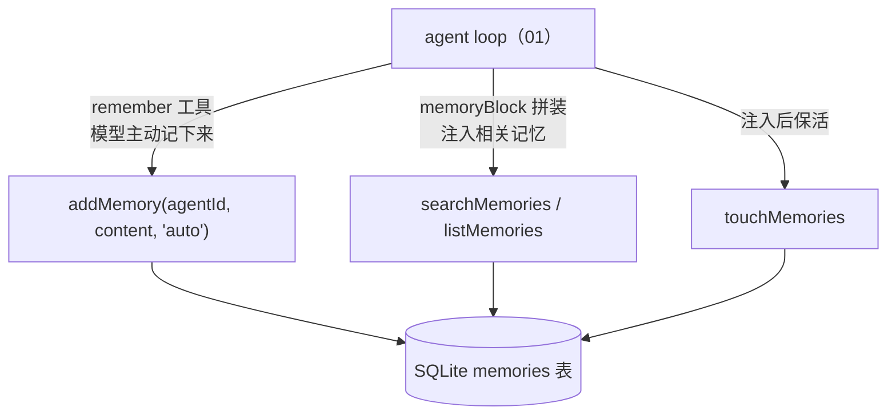

# 代码走读 05：跨会话记忆 —— 模型怎么"记得你"

> 上个会话你说过"我喜欢简洁的回答"，下个会话它就忘了——因为没有记忆。
> 这篇讲 `server/memory.ts`（约 186 行）怎么给 agent 一双"长期记忆"：写入去重合并、容量 LRU 控制、按相关度检索注入。
> 建议顺序：01 → 04（skill 注入那条线）→ 这篇。

## 0. 术语速查

| 名词 | 大白话 |
|---|---|
| **跨会话记忆** | 存在"对话历史之外"的长期事实（如个人偏好、项目约定），跨会话有效。对话历史是一本书，这是贴在手边的便签 |
| **持久化** | 数据写进磁盘（这里是 SQLite 本地库），重启不丢 |
| **LRU（Least Recently Used）** | 淘汰策略：容量满了优先删"最久没被用过"的。高频记忆保得住，低频记忆让位 |
| **去重合并（dedup+merge）** | 写新记忆时，若跟旧记忆"高度相似"，就**更新旧条**而不是新增——防止同一个事实重复存 N 条 |
| **相似度 / Jaccard** | 衡量两段文字多像。经典 Jaccard＝交集/并集；本项目的变体见 §4 |
| **bigram（2-gram）** | 切成"相邻两字"的片段集合（"简洁的回答"→ 简洁/洁的/的回/回答）。中文常用，一个词常由两个字构成 |
| **短侧覆盖率** | 交集 ÷ 较小那个片段集合的大小。适合判断"A 是不是对 B 的补充/改写"（§4 细讲） |
| **Top-K** | 只取排名前 K 个结果（这里是相关度最高的前 5 条记忆） |
| **词面检索** | 按"字符串包含"匹配（穷人的相似度）。比语义检索（embedding 向量）粗糙，但零依赖、可解释 |
| **Embedding / 向量库** | 把文字转成向量、按"语义远近"匹配的现代做法。**本文件刻意不用**，理由见 §3 |
| **FTS（全文检索）** | 数据库的全文索引。**也刻意不用**，理由见 §3 |
| **touch（保活）** | 记忆被用上时，刷新它的"最近使用时间"——LRU 淘汰时它就不会先被删 |
| **存量归并（consolidate）** | 与"写入时去重"不同：这是**定期对整个记忆库扫一遍**，把历史里积存的高相似条目合并（防"同一事实被不同表述存了 N 次"） |
| **节流（throttle）** | 高成本操作不每次都做，隔一段时间才做一次（这里是每 5 分钟最多归并一次，防每次写入都 O(n²)） |
| **AGENTS.md（项目记忆文件）** | OpenAI/GitHub 推的开放文件约定："给 agent 看的项目说明"，Claude Code / Codex 等多家都读。放工作区根目录，每次对话自动读入 prompt |

---

## 1. 它在架构里的位置



记忆有两个**来源**（`source` 字段）：
- `auto`：模型在对话里主动调 `remember` 工具（"用户喜欢简洁"这种）
- `manual`：用户在记忆管理页手动加的

**每条记忆都按 agent 隔离**（`agent_id`），不同 agent 的记忆互不串——A 的记忆不会污染 B。

---

## 2. 一条记忆长什么样（L12-19）

```ts
interface Memory {
  id: string
  agentId: string     // 谁的记忆
  content: string     // 记忆内容（一段话）
  source: 'auto' | 'manual'  // 哪来的
  createdAt: number   // 创建时间
  lastUsedAt: number  // 最近一次被"用上"的时间（LRU 靠它）
}
```

三个关键常量（L22-26）：
```ts
MEMORY_MAX_LENGTH = 200          // 单条最长 200 字（防超长垃圾）
MEMORY_LIMIT = 100               // 每 agent 最多 100 条（防无限膨胀）
MEMORY_MERGE_THRESHOLD = 0.6     // 相似度达到它 → 视为同一事实，合并
```

**两条上限，防两坨垃圾**：单条太长是垃圾，条数太多是膨胀。定死它，记忆库永远在一个可控小规模。

---

## 3. 设计取舍：为什么不引向量库 / 不用 FTS（L1-2）

```ts
// 跨会话记忆：按 Agent 隔离，LIKE 子串检索（记忆量小，全表扫描足够快；
// 避免 FTS5 中文分词问题，不引向量库——可解释、零依赖）
```

这是全文件最值得学的一行**取舍**。记忆最多 100 条 × 每 Agent，**量很小**——全表扫描就够快，不需要 FTS 全文索引（那是对海量文本设计的）；也不引 embedding 向量库：
- **中文分词是坑**：FTS 中文要分词器，向量要模型，都复杂
- **可解释**：字符串包含就是"有就是有"，学生能看懂"它为什么觉得相关"；向量相似度是黑盒
- **零依赖**：和项目一贯哲学一致，够用即止

> 记住这个判断框架：**先问"规模多大、要什么精度"，再问"要不要上重型方案"**。杀鸡不用牛刀。

---

## 4. 相似度：bigram + 短侧覆盖率（L48-66）

```ts
function bigrams(s: string): Set<string> {   // "简洁的回答" → {简洁,洁的,的回,回答}
  ...
  for (let i = 0; i + 2 <= t.length; i++) out.add(t.slice(i, i + 2))
}

export function similarity(a, b): number {
  const inter = 交集(...)
  return inter / Math.min(ga.size, gb.size)   // ← 短侧覆盖率
}
```

**为什么用"短侧覆盖率"而不是经典 Jaccard（交集/并集）**：

考虑"用户喜欢简洁的回答"新增一条"用户喜欢简洁的回答，也接受表格"。两者很可能是**同一条事实的更新**（补充了个细节）。
- 经典 Jaccard：交集 = 整段旧内容，并集 = 新内容几乎两倍长 → 值不过半条 → 约 0.5+，可能不达阈值
- 短侧覆盖率：交集 ÷ **较短那侧**（=旧内容自己）→ 接近 1 → 判定"旧内容被新内容完全覆盖"→ **合并**

一句话：**覆盖率回答的是"A 是不是 B 的补充/改写"**，这恰恰是"同一事实的更新"最常见的形态。加的注释（L63-65）把这个动机写得很清楚——这就是"注释写为什么，不写是什么"的示范。

> 顺带：为什么用 bigram？中文两字词多（"回答""简洁"……），所以相邻两字做特征，比单字准、比整句省。

---

## 5. 写入：加约束 → 去重合并 → LRU 淘汰 → 插入（L76-120）

```ts
export function addMemory(agentId, content, source = 'manual') {
  // ① 校验：非空 + 200 字上限
  // ② 去重合并：遍历现有记忆，谁相似度 ≥0.6 → 更新那条（不新增）✓ merged=true
  // ③ 若没合并且达到 100 条上限 → 先删最久没用的（LRU：ORDER BY last_used_at 最早）
  // ④ INSERT 新记忆
}
```

写一条记忆的完整流程 = 一套**防膨胀三连**：
1. **内容校验**（防单条垃圾）
2. **去重合并**（防重复：同一事实更新，而不是越存越多）
3. **LRU 淘汰**（防总量：满了删最久没用过的）

这三点正是"长期记忆系统的自我克制"——**生活在大模型时代，不加约束的记忆系统三天就变成垃圾场**。

---

## 6. 读取：相关度检索 + 注入（L154-186）

```ts
export function searchMemories(agentId, query, limit = 5): Memory[] {
  // ① 把用户这句话按标点/空白切成"片段"（如"帮我推荐 简洁 的回答" → ["帮我推荐","简洁","的回答"]）
  // ② 每个片段去每条记忆里数"命中几次"
  //    短片段（≤8字）：直接 content.includes(f)
  //    长片段（中文整句没空格）：拆成 2-gram，跟记忆内容交叉计数
  //    命中即标记 exact
  // ③ 按命中数排序（同命中数时 exact 优先）→ 取 Top-5
}
```

**为什么要切片段再数命中**：用户一句"我上次让你记住的简洁回答叫什么来着"里，只有"简洁"和"回答"是线索。整体匹配会全军覆没，切碎了反而能命中。这正是穷人的中文"分词"——**不靠分词器，靠切分 + 2-gram 交叉**。

注入后在 agentLoop 里还有一个收尾（见 01 篇 memoryBlock）：
- 命中不足 3 条时，用**最近记忆**补齐到 5 条（"我有什么偏好"这种无共同词的问题，靠 recency 兜底）
- 注入完 `touchMemories` 给命中条刷新 last_used_at 保活

---

## 6.5 记忆系统只剩一层便签？这里的第二、三道防线

写完 05 篇初版后，很多人会问："就一张表 + 子串检索，这也太贫瘠了吧？"
对照 Claude Code 会看到差距——它有三套东西我们当时缺（这也是本项目的演进方向，见 `memory.ts` 最新代码）：

### 第一道补充：项目记忆文件（AGENTS.md）—— 文件级的"项目宪法"

Claude Code 的 `CLAUDE.md` 是它的专属命名；我们作为开放项目，用的是 **`AGENTS.md`**——
OpenAI 牵头、GitHub 推进的**开放标准**（Claude Code / Codex 等多家 agent 工具都读同一约定），
无品牌归属、能跨工具互操作。

```ts
// memory.ts：读工作区下的 AGENTS.md（+ AGENTS.local.md 私有追加）
export function loadProjectMemory(customDir?): string {
  for (const file of ['AGENTS.md', 'AGENTS.local.md']) { ...读文件、拼进返回值 }
}
```

- `AGENTS.md`：**项目共享约定**（入库，git 可控）——技术栈、目录结构、常用命令、约定俗成
- `AGENTS.local.md`：**个人私有说明**（`.gitignore` 排除，不入库）——只在本机生效的偏好
- 两个文件存在就**每次对话自动读进 system prompt**（agentLoop 里拼成"项目说明"块）

**它和记忆表的分工**（这是最值得懂的部分）：
- 记忆表（前面几节）：模型**自己攒的**长期事实（偏用户个性化）
- AGENTS.md：**人和团队写的**项目事实（偏工程约定）——"改代码前先看它"

动手试：在工作区根写个 `AGENTS.md`（如"所有回复以『按项目约定』开头"），然后随便聊一句——
agent 真的会遵守。你就体验到了"文件即记忆"比"便签表"更像团队的"项目宪法"。

### 第二道补充：存量归并（consolidateMemories）—— 记忆的自我维护

写入时的去重合并只管"**新写的** vs 旧的"；但如果**历史里本身就攒了**几条近似表述呢？
（比如"用户喜欢简洁"和"用户喜欢简洁的回答，不要长篇大论"在不同会话各存了一次）——
写入合并救不了已存在的重复，所以有了 `consolidateMemories`：

```ts
export function consolidateMemories(agentId): number {
  // 全表两两比较相似度 ≥ 阈值 → 保留较新一条，删较旧
  // 由 addMemory 在"新增后"按 5 分钟节流触发（防每次写入都 O(n²)）
}
```

对比清楚：
| | 写入去重合并（原） | 存量归并（新） |
|---|---|---|
| 时机 | 写新记忆时 | 定期对存量扫一遍 |
| 管什么 | 新 vs 旧 | 旧 vs 旧（历史积压） |
| 代价 | 只比一次 | O(n²)，所以节流 |

这跟 AGENTS.md 一起，把"一张便签表"升级成"**文件约定 + 自动提取 + 定期整理**"的完整记忆系统——一步不依赖向量库，仍是可解释、零依赖。

---

## 7. 名词复盘 + 动手建议

**一句话记牢**：记忆 = 写(去重合并+LRU) + 读(切片段数命中 Top-K) + 保活(touch)；量小就用子串匹配，不上向量库。

动手做：
1. **记一条**：让 agent 记住"用户喜欢表格化输出"，去记忆管理页看到它；再换种说法让它"更新"同一条——看 `merged` 生效（详情里"已更新"字样）。
2. **试 LRU**：用脚本连加 100+ 条不同记忆（或临时把 `MEMORY_LIMIT` 改小验证），观察最旧的被淘汰——前提：先构造出"最久没用"的。
3. **看合并阈值**：分别试两条"几乎一样"打成一条，"完全相反"打成两条，体会 0.6 阈值的分界。
4. **读代码找设计**：在 `addMemory` 里临时把 `similarity` 改成返回 0，重启后重复保存——你会看到"没有去重合并会怎样"，就知道它为什么重要。
5. **写 AGENTS.md 试"项目宪法"**：工作区放个 `AGENTS.md` 约定一句话，随便聊一句，看 agent 遵守——这就是"文件即记忆"（§6.5）。
6. **攒近似条目看归并**：手动画两条近似记忆（或用脚本），触发一次 `consolidateMemories`（或等新增后节流触发），观察重复条目被清。

---

## ✅ 读完自查（你能做到吗）

- [ ] 能说出记忆写入的"防膨胀三连"（内容校验 / 去重合并 / LRU 淘汰），并各举一个防的"垃圾"场景
- [ ] 能解释为什么这里刻意不用向量库 / FTS：量小 + 中文分词坑 + 可解释 + 零依赖
- [ ] 能区分记忆表（模型自己攒的个性化事实）与 AGENTS.md（人和团队写的项目约定）的分工
- [ ] 能说出"短侧覆盖率"比经典 Jaccard 好在哪（判断"A 是不是 B 的补充/改写"）
- [ ] 动手：让 agent 记住一条偏好，换种说法再让它"更新"同一条，看 `merged` 生效

> 卡住了？回头读对应小节；做完这 5 条再进 [练习册 05](../exercises/05-memory.md)。


## 附：关联地图

```
memory.ts（本篇：跨会话记忆）
 ├── agentLoop.ts → addMemory(remember工具) / searchMemories+listMemories（注入） / touchMemories（保活）
 ├── db.ts        → SQLite memories 表
 ├── store.ts     → newId（记忆 id）
 └── 记忆管理页    → list / update / delete（UI 人工维护）
```

下一篇（06）建议：`server/compact.ts` —— 上下文压缩：token 感知 + 双兜底，长对话不爆。
