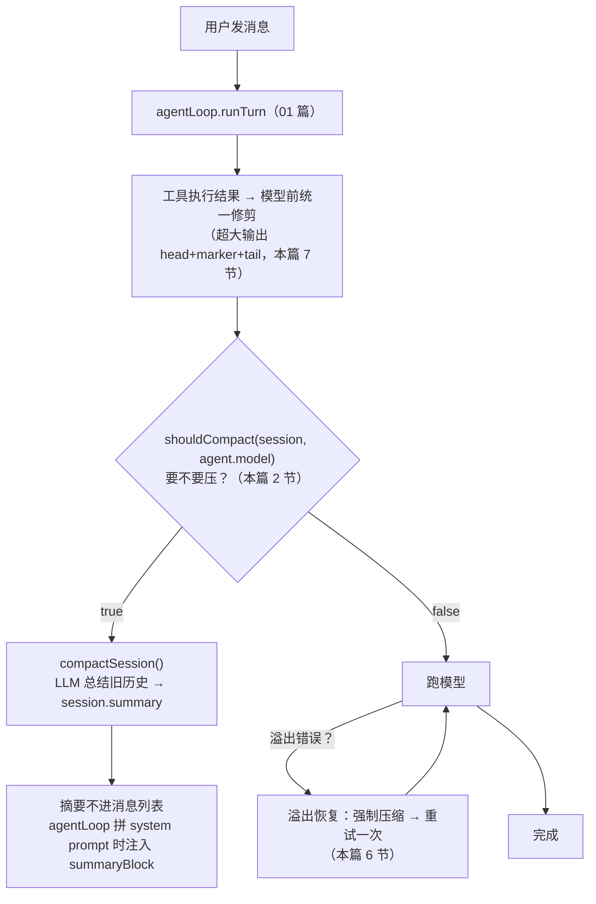

# 代码走读 06：上下文压缩 —— 长对话不爆，全靠它兜底

> 聊得越长，发给模型的历史越多：烧钱、变慢、甚至超出模型的"上下文窗口"直接报错。
> 成熟产品（Claude Code 这类）的做法是：接近上限时，用模型把旧历史"总结成摘要"顶上去。
> 这篇讲 `server/compact.ts`（约 230 行）——什么时候压、怎么算占用、怎么压，
> 以及为了"照抄 DSH"补上的两件利器：**工具结果修剪** 与 **溢出自动恢复**。
> 建议顺序：01 → 01 里的"压缩前置"那段 → 这篇。

## 0. 术语速查

| 名词 | 大白话 |
|---|---|
| **上下文窗口（context window）** | 模型一次能"看见"的最大 token 数。超了会被截断或报错。主流模型 1M = 100 万个 token（约几十万汉字） |
| **token** | 模型读写文本的计数单位（01 篇讲过）。上下文窗口、计费都以它计 |
| **上下文占用（context usage）** | 当前这一轮发给模型的总 token 数（历史 + 新消息）。接近窗口上限就该处理 |
| **真实计数 vs 估算** | 真实计数＝API 返回的实际 token 数（准）；估算＝按字符数猜（不太准但免费）。能用真实的不估，估不着的才估 |
| **压缩（compaction）** | 把"较早的一批消息"交给模型，让它总结成一段摘要，替代掉那批原文——腾出上下文空间 |
| **摘要（summary）** | 压缩的产物：一段保留"目标/关键事实/完成/待办"的浓缩文本 |
| **阈值（threshold）** | 触发压缩的门槛（如"占用超窗口 90%"或"消息超 40 条"） |
| **兜底（fallback）** | 主方案没戏时的保底。这里"消息数 40 条"就是"token 感知"之外的保守兜底 |
| **percent（百分比）** | 压缩阈值按"占窗口的百分之多少"算（默认 90%）——成熟项目做法（Claude Code 默认 ~95%） |
| **generateText** | AI SDK 的一次性生成（不像 streamText 是流式）：要一段文字就用它 |
| **双条件触发** | "消息数超限 **或** 占用超百分比" 任一成立就压——两层保险 |
| **保留比例（retain ratio）** | 压缩后保留多少"原文尾巴"（默认窗口的 16%）——按 token 预算保留，而不是只按条数 |
| **修剪（prune）** | 超大的工具输出喂给模型前，裁成"头 + 中间省略标记 + 尾"，防止它撑爆上下文 |
| **溢出恢复（overflow recovery）** | 模型报"上下文超了"时：先压缩旧历史 → 重试这次请求，而不是直接失败 |

---

## 1. 它在架构里的位置



**压缩和记忆是两回事**（别混）：
- **记忆**（05 篇）：跨会话长期事实，存独立表，常驻
- **压缩摘要**：本会话早期历史的浓缩，临时顶替旧消息，跟着这个 session 走

---

## 2. 四个参数，两套保险（L7-17）

```ts
COMPACT_MIN_MESSAGES = 40   // 消息数兜底：超过 40 条就压
COMPACT_KEEP        = 20    // 压完保留最近 20 条（更早的进摘要）
COMPACT_RETAIN_PCT  = 16    // 保留预算：保留部分 ≤ 窗口 × 16%（DSH retainRatio，见 5 节）
COMPACT_PCT         = 90    // 占用超窗口 90% 就压（可 NOVA_AGENT_COMPACT_PCT 覆盖）
```

触发逻辑（shouldCompact）：
```ts
export function shouldCompact(session, model?): boolean {
  if (session.messages.length > COMPACT_MIN_MESSAGES) return true   // 保险①：条数兜底（保守，无 token 时也能兜）
  if (!model || !session.messages.length) return false
  const window = contextWindowFor(model)
  return contextUsage(session.messages) > (window * COMPACT_PCT) / 100  // 保险②：token 占用（精确，主方案）
}
```

**为什么双重**：token 感知是"精确体温计"，但有些消息没 token 记录（早期数据、用户输入），体温计失灵时——**消息条数兜底**保证"聊到 41 条无论如何都会压一次"。成熟项目这也正是标配：**百分比阈值为主 + 条数为保守兜底**。

---

## 3. 占用怎么算：真实计数优先

```ts
export function contextUsage(messages) {
  // 找最后一条"带真实 input count"的 assistant 消息
  // 它记录的是"那一次请求的完整输入 token 数"——API 真值，已包含全部历史
  // 以它为基准，再加它之后新消息的估算
  ...
}
```

**关键洞察**：每轮对话，API 返回的 `input_tokens` 是"这次送进去的完整 token 数"（**已经包含所有历史**）。
所以**不要傻傻把每条消息的 token 加起来**（会重复计）——而是拿最近一次的真值当基准，只对"之后新增的"做补充估算。这是"成熟项目做法"的核心：**能用真实计数的，绝不用累加猜测**。

补估算用 `estimateTokens`：
```ts
// 中文约 0.7 token/字，其他约 0.25 token/字符
return Math.ceil(cn * 0.7 + other / 4)
```
中文稠密（一个字约零点几个 token），英文稀疏（四个字符约一个 token）——这是经验近似，够用。

**窗口兜底**（sanitizeContextWindow）：注册表里配的窗口万一坏了（0/负数/非数字），一把拉回缺省 1M，防止进度条/压缩阈值算出畸形值。**防御性编程**：不是不会出问题，而是出了问题也不炸。

---

## 4. 压成什么样：summarizeMessages

压缩 = 用一次 LLM 调用，把旧历史变成一段摘要。三步：

**① 拼"对话文本"**——旧消息变成给模型的输入：
```ts
## 用户
……内容……
  - 调用了工具 web_search（失败）

## 助手
……回复……
```
- 工具调用细节**只保留一个名字 + 成败**——"机械细节省略，关键结果保留"，省 token
- 整段截断到 30000 字符——**防止喂给摘要模型的本身超上下文**

**② 结构化指令**——给助手（摘要模型）的"考试要求"：
```
保留：用户目标与需求、关键事实/决定、已完成工作、未完成或待办、重要数据与结论
省略：寒暄、重复、工具调用的机械细节
总长度 ≤ 2000 字符；以"对话摘要："开头；直接输出正文，不要解释
```
**写出"保留什么、省略什么"** 是关键——摘要模型不是随便概括，是照着这份"审计清单"干活。

**③ 生成 + 长度保险**：`generateText` 产出后超 2000 字符就截。

---

## 5. 保留多少：条数 + token 预算双约束（computeKeepFrom）

旧版只按条数保留（最近 20 条）。但"20 条"对不同长度的消息不公平：
- 20 条超长消息（每条 5000 token）→ 保留部分就 10 万 token，小窗口模型照样爆
- 20 条超短消息 → 又留得太少，模型缺上下文

DSH 的做法（retainRatio 默认 0.16）是**按 token 预算保留**。Nova 对齐成 `computeKeepFrom`：

```ts
// 纯函数：计算"保留起点"（从该下标起保留到末尾）
// 1) 最多保留最近 keepCount 条；
// 2) 若这些条估算 token 超 retainBudget，把最旧的保留消息并入压缩范围，
//    但至少保留 COMPACT_MIN_KEEP 条（默认 5，保证模型有上下文可依）
export function computeKeepFrom(messages, keepCount, retainBudget): number {
  let keepFrom = messages.length - keepCount
  if (keepFrom <= 0) return -1                    // 没有可压缩的旧消息
  if (retainBudget > 0) {
    // 累计"保留部分"的估算 token；超预算就一条条把最旧的挪进压缩范围
    while (keptTokens > retainBudget && 剩余条数 > COMPACT_MIN_KEEP) keepFrom += 1
  }
  return keepFrom <= 0 ? -1 : keepFrom
}
```

**为什么抽成纯函数**：它不依赖 LLM、不碰 session，输入输出都是普通值——**单测友好**（compact.test.ts 里有 5 条专门测它：默认条数、keep 覆盖、预算收紧、预算充足、无可压缩）。把"易测的纯逻辑"和"要调 LLM 的副作用"拆开，是后端代码的好习惯。

`compactSession` 还支持两个覆盖项（**溢出恢复用**，见下节）：
- `force: true` —— 忽略"40 条"门槛，消息少也压（溢出时历史再短也得腾点空间）
- `keep: 6` —— 保留条数降到 6（比平时的 20 更激进）

摘要**不进消息列表**，放 `session.summary` 独立字段；下面所有 turn 靠 01 篇的 `summaryBlock` 注入 system prompt。为什么？
- 摘要进消息列表 = 它会参与后续计数/再压缩，越滚越大
- 放独立字段 = 每轮固定拼进 prompt，干净可控

前端压缩横幅读 `session.summary` 显示"已压缩 N 条 + 摘要内容"（溢出触发的会多标一句"溢出自动恢复"）。

---

## 6. 溢出自动恢复：压一次，重试一次（agentLoop.attemptModel）

**前置压缩拦不住所有溢出**：turn 开始前压过一次，但跑着跑着工具结果累计、历史又涨上去，模型的窗口还是可能被顶穿——这时 API 直接报 `context window exceeded` 一类的错。

DSH 的做法（`compaction-basic` 的 context-overflow recovery）：
> 模型报"上下文溢出" → 先压缩旧历史 → 重试这次请求（默认最多重试 1 次）

Nova 在 `agentLoop.ts` 里对齐成 `attemptModel()`：

```ts
// 返回 'ok'（成功）/ 'overflow'（溢出，可恢复）/ 'error'
async function attemptModel(): Promise<'ok' | 'overflow' | 'error'> {
  // 每次尝试内重新组装 system + history（压缩会改写 session，重试要拿到新上下文）
  const summaryBlock = ...
  const system = `${persona}...${summaryBlock}...`
  const history = session.messages.slice(0, -1).map(...)  // 压缩后变短了
  const result = await streamText({ ... })
  try { await result.steps } catch (err) { if (!interrupted) modelError = err }
  ...
  if (modelError && isContextWindowExceededError(modelError)) return 'overflow'
  return modelError ? 'error' : 'ok'
}
```

**两个工程要点**：

1. **识别"溢出"靠专门的正则**（`isContextWindowExceededError`，compact.ts）——各 provider 的措辞五花八门（`context length/window exceeded`、`maximum context length`、`input is too long for this model`…），照抄 DSH 的 `dsh-llm` 模式集，且**沿 cause 链**查（很多错误被 `fetch failed` 之类包装，真身在 `err.cause` 里）。
2. **组装必须在尝试函数内**——压缩会改写 `session.summary` 和 `session.messages`，重试前必须重新读，否则重试的还是同一份爆掉的上下文。

主流程：
```ts
let outcome = await attemptModel()
if (outcome === 'overflow') {
  // 溢出恢复：force 压缩（保留更少）→ 腾出空间才重试
  const cres = await compactSession(session, agent, { force: true, keep: OVERFLOW_COMPACT_KEEP })
  if (cres) { emit compact(trigger='overflow'); outcome = await attemptModel() }
  // 压不动（如全是本轮新消息）→ 不重试，直接透出原错误，避免白白重跑工具
}
```

**教学重点**：溢出时**压不动就不重试**（否则白跑一遍工具、可能重复副作用）。只有压缩真腾出空间才重试一次——这跟 DSH 的 `maxOverflowRetries = 1` 对齐。

> 已知取舍：Nova 的重试会**从第一步重跑工具**（AI SDK 的内部循环无法断点续跑）；DSH 有日志重放能做到不重跑。对教学项目这是可接受的——修剪（下节）已让"工具结果撑爆窗口"变得罕见，溢出重试只是兜底。

---

## 7. 工具结果修剪：超大输出先瘦身（pruner）

**撑爆上下文的元凶往往不是对话，而是工具输出**：`run_command` 一次打印几千行日志、`read_file` 读一个大文件、`web_search` 返回一堆长摘要——动辄几万字符，直接顶穿窗口。

DSH 的 `tool-result-pruner`：超过阈值就裁成 **头 + 中间省略标记 + 尾**（保留开头关键信息和结尾结论），默认 **8192 → 头 4096 + 标记 + 尾 1024**。Nova 照抄：

```ts
export const PRUNE_MARKER = '\n\n[... tool result middle pruned ...]\n\n'
export const PRUNE_THRESHOLD_CHARS = 8192   // 超这个长度才修剪
export const PRUNE_HEAD_CHARS = 4096        // 保留开头
export const PRUNE_TAIL_CHARS = 1024        // 保留结尾

export function maybePruneToolOutput(text: string): string {
  // 按 Unicode 码点切（Array.from），不拆 emoji 这类代理对
  if (len <= THRESHOLD) return text
  return head + PRUNE_MARKER + tail
}
```

**为什么按码点不按 `.length`**：`'😀'.length === 2`（UTF-16 两个单元），按 `.length` 切会把一个 emoji 从中间劈成两个乱码。`Array.from` 按完整码点切，稳。

**喂给模型的内容修剪，展示给用户的留完整**（`agentLoop.toolResultForModel`）：
```ts
function toolResultForModel(res, record) {
  if (res.isError) return res          // 错误信息短，不修剪
  const pruned = maybePruneToolOutput(res.content)
  if (pruned === res.content) return res
  if (record) record.modelPruned = true   // 打个标记，前端工具卡显示"模型侧已修剪"
  return { ...res, content: pruned }
}
```
所有工具执行出口统一走它：MCP 工具、web_search、run_command、glob、subagent——**一个收口，处处生效**。`record.output` 仍是完整原文（轨迹/导出/前端展示不丢），只是模型读到的是修剪版。前端工具卡据此显示"模型侧已修剪"徽章，教学上让用户直观看到"上下文治理"在起作用。

---

## 8. 名词复盘 + 动手建议

**一句话记牢**：压缩 = 占用超 90%（token 真实计数优先）**或**消息超 40 条就触发 → 用 LLM 把最早的总结成摘要 → 保留最近 N 条（还受"窗口 16% 的 token 预算"约束）；工具输出超大先修剪；真溢出就强制压缩 + 重试一次。

动手做：
1. **快速触发：** 启动时设 `NOVA_AGENT_COMPACT_MIN=5`，聊 6 条左右就触发压缩——看前端横幅"已压缩 N 条"，再看对话区顶部出现摘要。
2. **看计数逻辑：** 带一个超长聊天的 session，打印 `contextUsage`——体会"最后一条真实 input 是基准"。
3. **看修剪：** 设 `NOVA_AGENT_PRUNE_THRESHOLD=500`，让 Agent 跑一次输出很长的命令——工具卡出现"模型侧已修剪"徽章，展开看完整输出与模型看到的差异。
4. **看溢出恢复：** 设 `NOVA_AGENT_COMPACT_MIN=1000000`（禁掉条数兜底）+ 一个超长对话，触发模型溢出——横幅显示"溢出自动恢复"，且这轮没有直接失败。
5. **调保留预算：** 设 `NOVA_AGENT_COMPACT_RETAIN_PCT=1`，观察压缩后保留的消息明显变少（受预算约束）。

---

## ✅ 读完自查（你能做到吗）

- [ ] 能解释"双条件触发"：token 占用超 90%（真实计数优先）+ 消息数超 40 条的保守兜底
- [ ] 能说清为什么"不要傻傻把每条消息的 token 加起来"：API 的 input_tokens 已含全部历史，取真值当基准只补新增
- [ ] 能解释摘要为什么放 `session.summary` 独立字段而不是消息列表（否则越滚越大、参与再压缩）
- [ ] 能说出压缩提示词里"保留什么、省略什么"两条要求的意义
- [ ] 能说清"保留条数 + token 预算"双约束：为什么固定 20 条对超长消息不公平，`computeKeepFrom` 怎么兜底
- [ ] 能讲出"溢出恢复"的完整链路：识别溢出 → 强制压缩（force + 保留更少）→ 重试一次；压不动就不重试（为什么？）
- [ ] 能解释工具结果修剪：为什么按 Unicode 码点切、为什么"模型看修剪版、展示留完整"、`modelPruned` 标记干嘛用
- [ ] 动手：`NOVA_AGENT_COMPACT_MIN=5` 触发压缩看横幅；`NOVA_AGENT_PRUNE_THRESHOLD=500` 看"模型侧已修剪"徽章

> 卡住了？回头读对应小节；做完这 8 条再进 [练习册 06](../exercises/06-compact.md)。


## 附：关联地图

```
compact.ts（本篇：上下文压缩 / 修剪 / 溢出识别）
 ├── agentLoop.ts → shouldCompact / compactSession / summaryBlock 注入
 │               → toolResultForModel（修剪喂模型内容）/ attemptModel（溢出重试）
 ├── models.ts    → contextWindowFor（读模型注册表窗口）/ createModel
 ├── store/session → session.messages 与 session.summary（摘要独立字段）
 └── 前端          → 压缩横幅（trigger=overflow 显示"溢出自动恢复"）/ 工具卡"模型侧已修剪"
```

下一篇（07）建议：`server/workspace.ts` —— 工作区：agent 的文件权限边界（可配置 + 占位符 + 边界校验）。
