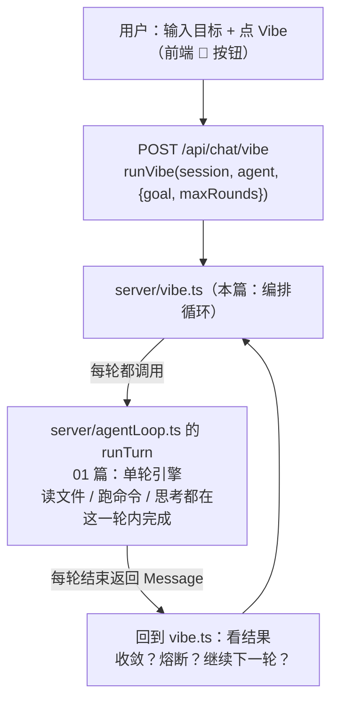

# 代码走读 08（完结篇）：Vibe 自治循环 —— 目标驱动，干到完成为止

> 前面 7 篇都在讲"一轮对话里 agent 怎么干活"。这篇是"升级"：**一条目标，agent 自己一轮轮干，直到收敛或明确失败**。
> `server/vibe.ts`（约 100 行）——在 `runTurn`（01 篇）之上加一层"编排循环"，实现 vibe coding 的内核。
> 读完这篇，整个系列收官：你已经把"一个 agent 怎么从零转起来"的全链路读完了。

## 0. 术语速查

| 名词 | 大白话 |
|---|---|
| **Vibe coding** | 用自然语言描述目标，让 AI 自己写代码、跑、看错、改、直到成功。Karpathy 带火的词。它和"聊天"的区别：**目标是终点，不是逐句问答** |
| **指令驱动 vs 目标驱动** | 指令驱动＝你说一句它答一句（普通聊天）；目标驱动＝你给目标它**自己连续干到底**（本文件） |
| **编排层驱动（orchestrator-driven）** | 循环是**外面的代码**在驱动，不是模型自己"自觉继续"。模型一个 turn 结束≠任务结束——**这是关键** |
| **收敛（converge）** | 任务做到"明确完成"的状态。判定方式见 [DONE] 协议 |
| **[DONE] 协议** | 约定：模型只有在"任务完成且验证通过"时，才用 `[DONE]` 开头回复。**这是收敛的唯一显式信号** |
| **自愈循环（self-healing loop）** | 上轮结果（含失败输出）拼进下轮 → 模型分析错误、修复、重验——"错→改→再验"的闭环 |
| **熔断（circuit breaker）** | 连续几轮输出**一模一样**＝疑似卡死 → 提前止损，不烧完轮数。防止"同一个错误反复试 5 遍" |
| **轮摘要签名（round signature）** | 取每轮输出末尾 300 字符算个哈希，用来比较"两轮是否相同"（失败信息通常在末尾） |
| **预算（budget）** | 轮数上限 + 总时长上限 + 每轮步骤上限（01 篇）——三重保险，防失控烧钱 |
| **resume（续跑）** | 每轮消息都落库；vibe 中断后再发一次，从历史接着跑，不从头再来 |

---

## 1. 它在架构里的位置：runTurn 的"上级"



**分层是清晰的**：`runTurn` = 一个回合（怎么转）；`runVibe` = 一串回合（转几圈直到干完）。
vibe **不自己干任何活**（不读文件不跑命令），它只做一件事：**决定"还要不要再来一轮"**。

---

## 2. 为什么循环必须由"编排层"驱动（L59 的 for 循环）

```ts
for (let round = 1; round <= maxRounds; round++) {
  const roundPrompt = round === 1
    ? `${goal}\n\n# 执行要求\n- 先读代码/确定方案，再动手实现...完成任务且验证通过后，回复以 [DONE] 开头...`
    : `${goal}\n\n# 第 ${round} 轮（上一轮结果）\n${lastOutput.slice(0, 4000)}\n\n# 要求\n- 如果任务已完成且验证通过，回复以 [DONE] 开头...否则：分析失败原因，修复后重新验证；禁止重复上一轮的相同尝试。`
  const msg = await runTurn(session, agent, roundPrompt, push)
  ...
}
```

**最值得记住的设计点**：模型**不会自己继续**。它跑完一轮，如果任务没完成，它只会停下来等你下一句。
所以"干到完成为止"必须由**外面的代码**驱动：跑完一轮 → 看结果 → 决定再来一轮 → 把结果喂回去。

这就是"编排层驱动"：**目标在代码里，不在模型的自觉里**。
（这也解释了为什么普通聊天问不出 vibe 效果——没有这层循环，模型永远不会"自己再试一次"。）

---

## 3. 收敛判定：显式 [DONE] 协议（L65-87）

```ts
if (content.trimStart().startsWith('[DONE]')) {
  return { converged: true, ... }
}
```

**为什么不能信"模型说完成了"**：模型经常**提前宣布完成**（"我写好了！"），其实没跑测试、甚至代码是编的。
所以约定一个**机器可判的显式信号**：只有回复以 `[DONE]` 开头，才认为收敛。

配合第一轮提示词里的约束——"[DONE] 前提是**任务完成且验证通过**"——把"验证"的责任压给模型：
- 第 1 轮就告诉它：**先读代码定方案 → 实现 → 用 run_command 验证 → 验证通过才 [DONE]**
- 后续轮：**上轮输出全文拼进本轮**（自愈反馈环）——模型看到自己上轮哪里失败，分析修复重验

**这就是"错→改→再验"的闭环**：每轮的失败输出，就是下一轮的输入。

---

## 4. 熔断：别烧完 5 轮在同一个错误上（L33-39, 89-96）

```ts
function roundSignature(output: string): string {
  const tail = output.slice(-300).trim()   // 失败信息通常在末尾
  ... // 算个简单哈希
}

const sig = roundSignature(content)
if (round > 1 && sig === lastSignature) {   // 连续 2 轮输出相同
  return { converged: false, stopped: 'circuit', ... }
}
```

**为什么光有轮数上限不够**：如果模型"反复栽同一个坑"（比如某个 API 永远调不通），它会每轮换个说法重试同一个错误——轮数上限 5 只会让它**把 5 轮全部烧完**。
熔断加一道：**连续 2 轮输出哈希相同 = 卡死**，立即止损，把"疑似卡死"报给用户。

这跟 03 篇 run_command 的"先温和后强杀"是同一个精神：**有限度的坚持，识别死局就收手**。

---

## 5. 三重预算（L50-51, 28-31）

```ts
const maxRounds = Math.max(1, Math.min(opts.maxRounds ?? DEFAULT_MAX_ROUNDS, MAX_ROUNDS_HARD_CAP)) // 轮数（默认5，硬顶20）
const deadline = Date.now() + Math.max(1, opts.maxMinutes ?? DEFAULT_MAX_MINUTES) * 60_000          // 总时长（默认15分钟）
```

三把保险（加上 01 篇里每轮内的 `MAX_STEPS` 步骤上限，共四重）：
1. **轮数**：最多跑几轮（用户可传，快速 3 / 标准 5 / 深度 10）
2. **时长**：累计超过 deadline（每轮之间检查，L61-63）——防"单轮很慢但轮数不多"的情况
3. **每轮步骤**：runTurn 自带的 24 步（01 篇）

**为什么预算这么多层**：vibe 是"无人值守自动烧"模式，失控成本比普通聊天高得多。层数越多，失控前的刹车越早。

---

## 6. 中断与续跑（resume）

- **中断**：用户在 vibe 运行中点停止 → `abortRun`（01 篇）→ 当轮 runTurn 被中断；下轮开始前 `Date.now() > deadline` 之类兜底或直接返回。命令进程也被进程树清理（03 篇）——不会留幽灵。
- **续跑**：**每一轮的消息都会落库**（runTurn 内部 push 进 session.messages）。vibe 中断后，会话里已经有一串"目标 + 每轮过程"。再点一次 Vibe 发同一目标，模型能看到之前的进度接着干——**天然 resume，不需要额外状态文件**。

这是"文件即状态"思想的体现：会话本身就是任务状态。

---

## 7. 名词复盘 + 动手建议

**一句话记牢**：vibe = 在 runTurn 外面套一层"要不要再来一轮"的循环；收敛靠 [DONE] 显式信号；卡死靠熔断；失控靠四重预算；中断靠进程清理，续跑靠消息落库。

动手做：
1. **体验一次收敛**：输入"在工作区写一个 `hi.txt`，内容 hello，然后用 node 读出来验证，完成就结束"→ 点 Vibe。观察它多轮自动执行，直到 [DONE] 汇报（通常 1-2 轮）。
2. **看自愈**：先故意在工作区放一个坏文件，vibe 目标"修复它并验证"——看它失败→读错→改→重验的闭环。
3. **看熔断**：给一个明显无解的目标（如"让 1+1=3 通过测试"），看它连续相同输出后被"熔断止损"。
4. **看续跑**：vibe 运行中打断，再发同一目标——它从历史接着干而不是从头来。

---

## 8. 全系列收尾：你已经读完了一个 agent 的全部核心

| 篇 | 你读懂了什么 |
|---|---|
| 01 agentLoop | 单轮怎么转（模型↔工具循环 + prompt 拼装 + 中断） |
| 02 mcp | 外部工具怎么变成 agent 的手（进程管理 + 健康检查 + 重连） |
| 03 terminal | 命令执行 + 进程生命周期（超时/中断杀树 + 平台坑） |
| 04 skills | 技能系统：文件即能力、目录 + 按需加载省 token |
| 05 memory | 记忆：文件级约定 + 自动提取 + 去重归并 |
| 06 compact | 长对话不爆：真实计数 + 双兜底压缩 |
| 07 workspace | 文件权限边界：默认兜底 + 危险目标拒绝 + 占位符联动 |
| 08 vibe | 目标驱动：编排循环 + 收敛协议 + 熔断 + 预算 |

**这 8 个文件加起来，就是一个"类 Claude Code" agent 的全部骨架**。
你现在能讲清楚：它怎么转、用什么工具、怎么记得你、怎么不烧爆上下文、怎么守住权限边界、怎么自己干完一件事。
这就是"一个晚上读完一个 agent"的兑现——接下来，改它、拆它、再组装成你自己的。

---

## ✅ 读完自查（你能做到吗）

- [ ] 能解释"为什么循环必须由编排层驱动"：模型不会自己继续，目标在代码里不在模型的自觉里
- [ ] 能说明 [DONE] 协议为什么是"机器可判的显式信号"而不是信模型说"完成了"
- [ ] 能说出熔断（连续 2 轮输出相同 → 止损）和"轮数上限"各自防什么、为什么缺一不可
- [ ] 能数出四重预算（轮数 / 时长 / 每轮步骤 / 熔断）并各说一个防失控场景
- [ ] 动手：给一个明显无解的目标（如"让 1+1=3 通过测试"），看它被熔断止损

> 卡住了？回头读对应小节；做完这 5 条再进 [练习册 08](../exercises/08-vibe.md)。
