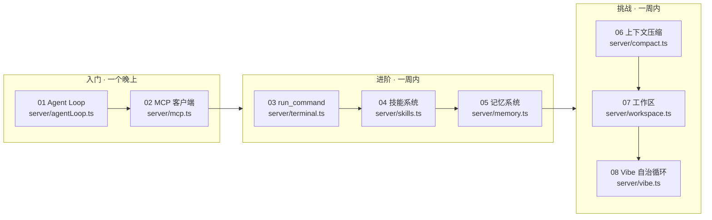

# 📚 Nova Agent 课程地图（读代码指南）

> 这不是一份"文档目录"，而是一门**课程**：按 8 个核心文件，把「一个 agent 怎么从零转起来」分三段学会。
> 每一篇 = 一节课：**先讲清名词 → 再逐段读代码 → 最后做练习**验证你*真的懂了*（不是"看懂了"）。
> 配套：每篇末尾有「读完自查」清单，另外有独立**练习册**（含答案分册）和一份**终极验收项目**。

---

## 🗺️ 三阶段学习路径

```
入门（一个晚上）── 能讲清楚"一轮对话里 agent 怎么干活"
 ├─ 01 Agent Loop：一个 agent 怎么"转"起来（最核心，必先读）
 └─ 02 MCP 客户端：外部工具怎么变成 agent 的"手"

进阶（一周内）── 能讲清楚"agent 的能力从哪来、怎么管"
 ├─ 03 run_command：agent 的双手 + 进程生命周期（含 Windows 平台坑）
 ├─ 04 技能系统：SKILL.md 文件即能力、目录 + 按需加载省 token
 └─ 05 记忆系统：模型怎么"记得你"（LRU + 去重合并 + AGENTS.md）

挑战（一周内）── 能讲清楚"长对话怎么不爆、边界怎么守住、怎么自己干完一件事"
 ├─ 06 上下文压缩：长对话不爆的兜底机制
 ├─ 07 工作区：agent 的文件权限边界
 └─ 08 Vibe 自治循环：目标驱动，干到完成为止
```

**为什么要这个顺序**：从**编排核心**（01 谁在转）出发，再到它的**能力来源**（02-05 工具/技能/记忆），最后是**健壮性与安全**（06 防溢出 / 07 防越界 / 08 自治收敛）——由里向外，每篇只用前面讲过的概念。



---

## 📖 课程目录（每篇 = 一节课）

| 课 | 阶段 | 走读文件 | 主题 | 前置 | 读完你能（验收标准） |
|---|---|---|---|---|---|
| [01](01-agent-loop.md) | 入门 | `server/agentLoop.ts` | Agent 循环：一个 agent 怎么转起来 | 无 | 讲清楚"一轮对话里模型↔工具怎么循环"；指出 7 个阶段的顺序与各自目的；说出 `streamText` 帮你做了什么、你在外围做了什么 |
| [02](02-mcp.md) | 入门 | `server/mcp.ts` | MCP 客户端：怎么把外部工具变成 agent 的手 | 01 | 讲清 MCP 的"server=独立进程 / client=我们"模型；说出连接 4 步；解释指数退避重连为什么有必要 |
| [03](03-terminal.md) | 进阶 | `server/terminal.ts` | run_command：双手 + 进程生命周期 | 01 | 解释"为什么杀进程要杀整棵树"；说出两个 Windows 平台坑；说明超时≠失败的设计意图 |
| [04](04-skills.md) | 进阶 | `server/skills.ts` | 技能系统：SKILL.md 目录 + 按需加载 | 01 | 写一个自己的 SKILL.md 并让它生效；解释"目录 + 按需加载"如何省 token；指出删除技能那行白名单校验为什么必要 |
| [05](05-memory.md) | 进阶 | `server/memory.ts` | 跨会话记忆：模型怎么记得你 | 01、04 | 说出记忆写入的"防膨胀三连"；解释为什么不上向量库；区分记忆表与 AGENTS.md 的分工 |
| [06](06-compact.md) | 挑战 | `server/compact.ts` | 上下文压缩：长对话不爆 | 01 | 解释"真实计数优先 + 条数兜底"的双触发；说出为什么摘要放独立字段；讲清"溢出恢复 + 工具结果修剪"两条护栏怎么兜底 |
| [07](07-workspace.md) | 挑战 | `server/workspace.ts` | 工作区：agent 的文件权限边界 | 01、02 | 说出三类被拒绝的"危险目标"及理由；解释大小写不敏感比较为何必要；说明 `{{workspace}}` 占位符的联动 |
| [08](08-vibe.md) | 挑战 | `server/vibe.ts` | Vibe 自治循环：目标驱动 | 01-07 全部 | 解释为什么循环必须由编排层驱动；说明 [DONE] 协议与熔断；说出四重预算分别防什么 |

---

## ✅ 怎么用这门课（学习法）

1. **先跑起来**：`npm install && npm run dev`，让 agent 真的能对话、能调工具。读代码时对照着运行中的系统看，印象深十倍。
2. **按顺序逐篇读**：先 01（最核心），再 02-05（能力来源），最后 06-08（健壮性/安全/自治）。
3. **每篇读完 → 先做「读完自查」**：指南末尾有一段 3-5 条的能力清单，逐条自问"我能不能做到"。卡住的回到对应小节。
4. **再做对应「练习册」动手题**：`docs/exercises/` 下每篇有 3-5 道分级动手题（入门/进阶/挑战）。**先自己动手，做完才看答案**（`answers/` 分册）——"看懂"和"做得出"隔着一次动手。
5. **全部读完 → 做终极验收**：`docs/exercises/capstone.md`——"从零重写一个最小 agent"。能独立完成它，这门课你就毕业了。

> 📝 **学习时间参考**：入门约 2-3 小时（一个晚上）；进阶 + 挑战各约一星期（每天 30-60 分钟，边读边动手）。

---

## 📝 配套练习册

| 资源 | 说明 |
|---|---|
| [📘 练习册入口](../exercises/README.md) | 8 篇走读 × 每篇 3-5 道分级动手题（目标/步骤/预期结果/提示） |
| [🔑 答案分册](../exercises/answers/README.md) | 每题完整解法与讲解。**先做题，再对答案** |
| [🎓 终极验收项目](../exercises/capstone.md) | "从零重写一个最小 agent"——全系列综合，毕业作品 |

---

## 🧰 其他教学资料

| 资料 | 说明 |
|---|---|
| [📖 术语总表](../glossary.md) | 8 篇指南全部"黑话"汇总（协议/架构/工程/安全分类） |
| [📄 项目文档](../README.md) | 功能、架构、API、安全模型总览 |
| [🇨🇳 中文主页](../README.md) | 项目完整中文说明（仓库主页） |
| [🇬🇧 English](../README.en.md) | 项目完整英文说明 |

> 遇到黑话先翻对应篇的术语表，汇总版见[术语总表](../glossary.md)；没 covered 的欢迎提 issue。
